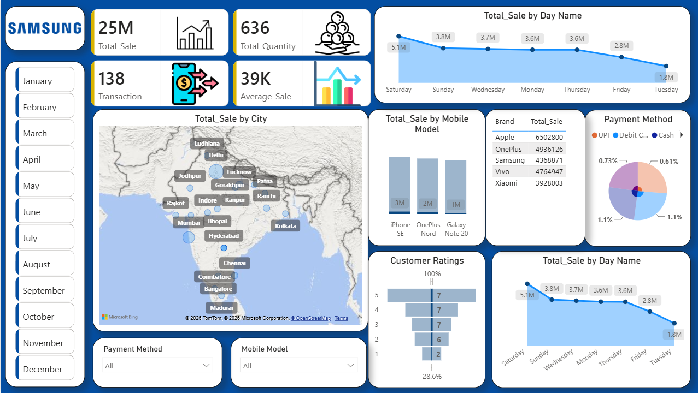

# 📊 Mobile Sales Dashboard

## 📌 Overview

This project is an interactive **Mobile Sales Dashboard** developed using **Microsoft Power BI** to analyze mobile sales performance across different cities, brands, payment methods, customer ratings, and sales trends.

---

## 🚀 Dashboard Preview

---

## 📈 Key Features

- Interactive Dashboard
- KPI Cards
- Sales by City (Map)
- Brand-wise Sales Analysis
- Mobile Model Analysis
- Payment Method Analysis
- Customer Ratings
- Day-wise Sales Trend
- Monthly Filters

---

## 🛠 Tools Used

- Microsoft Power BI
- Power Query
- DAX
- Microsoft Excel

---

## 📂 Files Included

- Mobile Sales Dashboard.pbix
- Dashboard Screenshot
- Dashboard PDF
- Dataset (Excel)

---

## 💡 Skills Demonstrated

- Data Cleaning
- Data Transformation
- Data Visualization
- Dashboard Design
- DAX Measures
- Interactive Reporting
- Business Intelligence

---

The dashboard provides insights into:

- Total Sales
- Total Quantity
- Transactions
- Average Sales
- Sales by City
- Brand Performance
- Customer Ratings
- Payment Method Distribution

---

## 👨‍💻 Author

Sachin Chauhan

Aspiring Data Analyst
